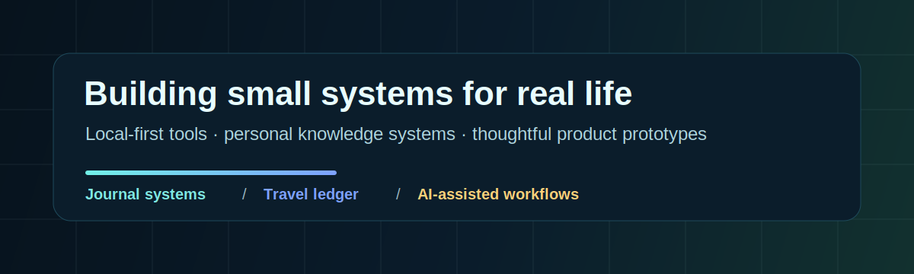

# Hi, I'm Jodie

我把 GitHub 当作一个小型作品库，用来展示自己正在做的本地工具、生活系统和产品原型。

我感兴趣的方向不是“做一个看起来很复杂的系统”，而是把真实生活里反复出现的问题整理成可使用的小工具：记账、日记、行动记录、阅读整理、旅行复盘、个人知识管理。

## What I Build

- **Local-first tools**：优先把数据保存在本地 Markdown 或前端状态里，方便自己长期掌控。
- **Personal systems**：把日记、计划、行动证据和复盘做成可以持续使用的结构。
- **Product prototypes**：用网页原型快速验证一个生活场景是否值得继续做。
- **AI-assisted workflows**：让 AI 帮忙整理、提炼、复盘，但不替代人的判断。

## Featured Projects

### [Obsidian Action Journal](https://github.com/jodieg536-byte/obsidian-action-journal)

一个本地运行的 Obsidian 日记与行动记录网页。

它解决的问题是：每天发生了很多事，但如果只写流水账，长期很难沉淀；如果系统太复杂，又很难坚持。这个项目用几个输入框，把每天的零散记录整理成：

- 完整 Obsidian 日记
- 行动证据
- 明天最小下一步
- 深度追问
- 可勾选的明日计划

**关键词**：Obsidian / Streamlit / Markdown / local-first / journaling

### [Travel Ledger](https://github.com/jodieg536-byte/travel-ledger)

一个旅行规划、记账、分账和回忆整理的网页原型。

它解决的问题是：旅行时，行程在聊天记录里，账单在支付软件里，照片在相册里，结束后很难统一整理。这个项目把旅行里的四件事放在一个界面里：

- 行程安排
- 多币种记账
- 团队分账
- 旅行回忆录

**关键词**：React / Vite / travel / expense tracker / product prototype

## Current Focus

我正在把个人生活里的高频场景，做成一个个能被实际使用的小作品：

- 日记系统：提升记录、思考和复盘质量
- 行动系统：把计划变成每天留下的证据
- 旅行账本：把旅行中的行程、费用和回忆统一整理
- 内容系统：把输入、写作和发布流程变得更可持续

## Principles

- **先解决真实问题，再谈功能完整。**
- **先让系统可持续使用，再追求复杂自动化。**
- **数据优先本地保存，展示再考虑云端。**
- **AI 是整理和提问工具，不是替我生活的人。**

## Tech I Use

## Repository Map

| Project | What it is | Status |
| --- | --- | --- |
| [obsidian-action-journal](https://github.com/jodieg536-byte/obsidian-action-journal) | Local-first journal and action tracking app | Usable prototype |
| [travel-ledger](https://github.com/jodieg536-byte/travel-ledger) | Travel planning and expense splitting prototype | Frontend prototype |

---

I like tools that make ordinary life easier to examine, organize, and continue.

